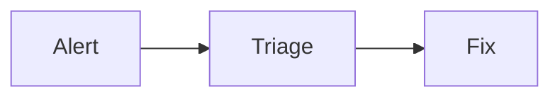

# Slidev

`Slidev` — open-source presentation framework для разработчиков: deck хранится как Markdown, а во время показа работает как Vite/Vue web application. Это не «PowerPoint в Markdown». Сильная сторона Slidev — презентация как versioned кодовый артефакт, в который при необходимости добавляются Vue-компоненты, live code, diagrams, presenter tools и интерактивность.

Проверенный package `@slidev/cli` на ветке `main` имеет версию **52.19.0**; последний GitHub release на момент обзора — `v52.19.0`. Лицензия репозитория — MIT.

## Модель deck: сначала текст, затем web runtime

Типичный проект начинается с `slides.md`. Разделитель `---` создаёт новый слайд; первый YAML frontmatter — глобальный headmatter deck, следующие frontmatter относятся к отдельным слайдам. Небольшой deck остаётся читаемым Markdown-файлом, но формат допускает HTML, scoped CSS, UnoCSS classes, Vue components, imported slide files и npm themes/addons.

```md
---
title: Incident review
theme: seriph
---

# Симптом и impact

---
layout: two-cols
---

# Причина

::right::


```

В результате Git становится нормальным source of truth: текст, диаграммы, speaker notes и конфигурация deck reviewable через diff. Но вместе с этим появляется обычная цена web stack: для сложной темы, CSS или Vue-компонента нужны frontend-дисциплина и preview, а не только хороший Markdown.

[Mermaid]({{ '/wiki/tools/mermaid' | relative_url }}) здесь — встроенный слой диаграмм: fenced `mermaid` block рендерится в браузере deck. Mermaid остаётся удобнее для отдельной документации; Slidev добавляет к нему narration, click steps и presenter context.

## Что делает runtime

`@slidev/cli` требует Node.js `>=20.12.0`. Основной рабочий контур:

| Команда | Результат | Граница |
|---|---|---|
| `pnpm create slidev` | создаёт проект со стартовым `slides.md` и scripts | нужен актуальный Node/package manager |
| `slidev` / `pnpm run dev` | Vite dev server с HMR и показом deck | это dev/presentation runtime, не готовый public deploy |
| `slidev build` | статический SPA в `dist` | интерактивность сохраняется в браузере; нужно выбрать hosting и base path |
| `slidev export` | PDF, PNG, PPTX или image-based Markdown export | нужен `playwright-chromium`; интерактивность в файлах не сохраняется |

В source `build` формирует SPA и добавляет `404.html`/`_redirects` для static hosting. Для GitHub Pages нужен base path вида `/repo-name/`; при публичной сборке docs рекомендуют `--without-notes`, иначе speaker notes могут оказаться в опубликованном артефакте.

Экспорт идёт через Playwright/Chromium. Это технически важно: PDF и PNG — рендер браузерного deck, а PPTX собирается из PNG-фонов; его текст не становится редактируемым PowerPoint-текстом. Для remote assets, iframes, animation и heavy code examples нужно смотреть итоговый export, а не верить успешному process exit. Документация отдельно предупреждает, что `networkidle` может тайм-аутиться и что менее строгий wait condition может дать неполный результат.

## Presenter и объяснение живого кода

Slidev даёт отдельный presenter view с текущим/следующим слайдом и notes, overview deck, click steps, drawing, camera view и browser recording. Для technical talk это практичнее, чем набор статичных страниц: код можно подсветить, развернуть по шагам, показать Mermaid/LaTeX, добавить Monaco/live examples или перейти к demo.

`--remote` включает удалённый доступ; `--remote=<password>` добавляет пароль для presenter mode. `--tunnel` поднимает Cloudflare Quick Tunnel и делает локальный dev server внешне доступным. Это режим показа, а не безопасный production deploy: не включать remote/tunnel с секретами в deck, не считать presentation server системой авторизации и выключать после события.

[OpenScreen]({{ '/wiki/tools/openscreen' | relative_url }}) решает соседнюю, но другую задачу. Slidev создаёт и проводит интерактивный technical deck, а OpenScreen записывает реальный продуктовый workflow и собирает video demo. Встроенная запись Slidev удобна для talk; polished capture приложения лучше делать отдельным recorder/editor.

## Встроенный MCP: удобный write surface, не магия

Начиная с `v52.17.0`, Slidev поставляет MCP server. Он доступен двумя режимами:

- HTTP по `http://localhost:<port>/__mcp`, когда запущен dev server;
- `slidev mcp [entry]` по stdio, без dev server.

Набор tools умеет читать overview/list/full source slides, изменять content/frontmatter/notes, вставлять, удалять и переставлять слайды; в live режиме есть переход на нужный слайд для visual check. Код подтверждает, что mutating tools сразу пишут Markdown обратно на диск и HMR подхватывает изменения. Remove отмечен как destructive tool; перемещение ограничено одним source Markdown file, а headmatter entry file защищён от удаления/перемещения.

[MCPorter]({{ '/wiki/tools/mcporter' | relative_url }}) нужен именно перед включением Slidev MCP в основной agent workflow: отдельно проверить transport, tools и working directory на test deck. Не давать агенту write-доступ к единственной презентации без Git, diff/review и backup. При ненадобности HTTP endpoint отключается `mcp: false` в headmatter; для чувствительного deck предпочтительнее localhost или stdio, а не tunnel.

## Где Slidev сильнее и слабее альтернатив

| Сценарий | Slidev подходит | Slidev не лучший выбор |
|---|---|---|
| Tech talk / workshop | Код, highlighting, click animation, interactive Vue demo и Git-review — естественный workflow | Если авторы не работают с Markdown/Git и хотят исключительно WYSIWYG |
| Документация как deck | Можно держать deck рядом с кодом, собирать SPA и PDF | Если нужен лишь один diagram — достаточно Mermaid в обычном Markdown |
| Agent-assisted deck | MCP/official skill дают structured deck edits и visual navigation | Агент всё равно может испортить narrative, overflow или architecture; нужен preview и review |
| Видео | Camera/recording есть для захвата talk | Для режиссируемого explainer/video нужен [HyperFrames]({{ '/wiki/llm-agents/hyperframes' | relative_url }}) или video pipeline; это другой output |
| PowerPoint delivery | Можно отдать PPTX/PDF | PPTX rasterized: это delivery file, а не редактируемый PowerPoint source |

## Реальные ограничения

1. **Markdown не отменяет вёрстку.** Deck с Vue, custom layouts, animation и global components — это frontend project с зависимостями, visual regressions и browser differences.
2. **Export — отдельный gate.** Нужен Chromium/Playwright; iframe, font, network и timing способны сломать export после того, как `dev` выглядит нормально.
3. **Интерактивность не переносится в PDF/PPTX.** Для опубликованного SPA нужен ещё доступный hosting, а для file export — финальный визуальный контроль.
4. **MCP меняет файлы.** Это не read-only design assistant: insert/update/remove/move вызывают запись Markdown. Выделять agent branch или работать в копии deck.
5. **Remote mode расширяет поверхность.** Password, tunnel и localhost endpoint имеют разные цели; не смешивать live demo, control plane и public hosting в одном неподготовленном процессе.

## Проверка источника

Проверена ветка `main` commit `1877b3014ecc8f256e8c4df799035252a1968fc2` от 14 августа 2026 года. GitHub Actions на этом exact SHA показывают success для `Test` и `Production Smoke Test`: workflow описывает build/test на Linux/macOS/Windows, typecheck, Cypress, упаковку и smoke fresh project через npm/pnpm на Linux/Windows. Это upstream CI evidence, не локальное воспроизведение.

Локальная проверка source tree не выполнялась: два `git clone` (обычный shallow и `--filter=blob:none` + sparse checkout) не завершились за 300 и 600 секунд соответственно; partial checkout остался непригоден для install/test. Вместо выдуманного результата проверены raw source files, package manifests, official docs, release metadata и exact-SHA CI. Перед внедрением в проект нужно сделать свой `pnpm create slidev` → `dev` → `build` → `export` smoke на целевом окружении.

## Практический вывод

Slidev оправдан, когда презентация — инженерный артефакт: её нужно хранить в Git, показывать код и diagrams, подключать живые веб-демо, выпускать SPA/PDF и итеративно улучшать с агентом. Для простых management slides или редактируемого корпоративного PPTX он часто избыточен.

Рабочая дисциплина: сначала Markdown narrative и checked facts → затем components/diagrams → `dev` visual review → отдельный export gate → public SPA или PDF. MCP ускоряет редактирование, но не заменяет содержание, дизайн и финальную проверку.

## Источники

- [slidevjs/slidev](https://github.com/slidevjs/slidev)
- [Release v52.19.0](https://github.com/slidevjs/slidev/releases/tag/v52.19.0)
- [Slidev guide](https://sli.dev/guide/)
- [MCP Server](https://sli.dev/features/mcp)
- [Exporting](https://sli.dev/guide/exporting)
- [Building and Hosting](https://sli.dev/guide/hosting)
- [Remote Access](https://sli.dev/features/remote-access)
